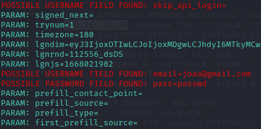

# Criando um Phishing com Kali Linux (SET Toolkit)

## Descrição

Este projeto foi desenvolvido como parte do desafio da DIO (Digital
Innovation One) na trilha de Cibersegurança.

O objetivo é demonstrar, em ambiente controlado de laboratório, como
ataques de engenharia social podem ser realizados utilizando a
ferramenta SET (Social Engineering Toolkit) presente no Kali Linux.

Neste experimento foi utilizado o método de clone de site para simular
uma página de login semelhante à do Facebook, com o objetivo de capturar
credenciais inseridas pelo usuário.

Aviso Importante: Este projeto possui finalidade exclusivamente
educacional. O uso dessas técnicas fora de ambientes autorizados pode
ser considerado crime.

Todo o experimento foi realizado em ambiente de laboratório controlado.

------------------------------------------------------------------------

## Ferramentas Utilizadas

-   Kali Linux
-   SET Toolkit (Social Engineering Toolkit)

------------------------------------------------------------------------

## Conceito do Ataque

O ataque utilizado neste laboratório é conhecido como Credential
Harvester.

Fluxo básico do ataque:

1.  Um site legítimo é clonado.
2.  A vítima acessa a página falsa acreditando ser o site verdadeiro.
3.  Ao inserir usuário e senha, os dados são capturados.
4.  As credenciais ficam registradas no terminal do atacante.

Esse tipo de ataque explora principalmente falhas humanas e não
vulnerabilidades técnicas.

------------------------------------------------------------------------

## Configuração do Ambiente

Abrir o terminal do Kali Linux e obter acesso root:

``` bash
sudo su
```

Iniciar o SET Toolkit:

``` bash
setoolkit
```

------------------------------------------------------------------------

## Passo a Passo no SET Toolkit

### 1 - Tipo de ataque

Selecionar:

Social-Engineering Attacks

### 2 - Vetor de ataque

Selecionar:

Web Site Attack Vectors

### 3 - Método

Selecionar:

Credential Harvester Attack Method

### 4 - Tipo de clonagem

Selecionar:

Site Cloner

------------------------------------------------------------------------

## Obtendo o IP da máquina

Para que a página falsa possa ser acessada é necessário obter o IP da
máquina que está rodando o ataque.

Comando utilizado:

``` bash
ifconfig
```

Exemplo de retorno:

192.168.0.15

------------------------------------------------------------------------

## URL utilizada para clonagem

No laboratório foi utilizado:

http://www.facebook.com

O SET Toolkit automaticamente realiza a clonagem da página.

------------------------------------------------------------------------

## Execução do Ataque

Após a configuração:

-   O SET Toolkit clona a página
-   Um servidor local é iniciado
-   A página falsa fica disponível através do IP da máquina

Quando um usuário acessa o endereço e insere suas credenciais, os dados
aparecem no terminal.

------------------------------------------------------------------------

## Resultado

Exemplo de captura de credenciais:



------------------------------------------------------------------------

## Estrutura do Projeto

    phishing-lab
    │
    ├── README.md
    ├── passwd.png

------------------------------------------------------------------------

## Conclusão

Este laboratório demonstra como ataques de engenharia social podem ser
simples de executar quando usuários não verificam corretamente a
autenticidade de páginas web.

Boas práticas de segurança incluem:

-   Conferir sempre o endereço do site (URL)
-   Utilizar autenticação em dois fatores (2FA)
-   Evitar clicar em links suspeitos
-   Utilizar gerenciadores de senha

O objetivo deste projeto é educacional, ajudando a compreender como
esses ataques funcionam para fortalecer a segurança da informação.
